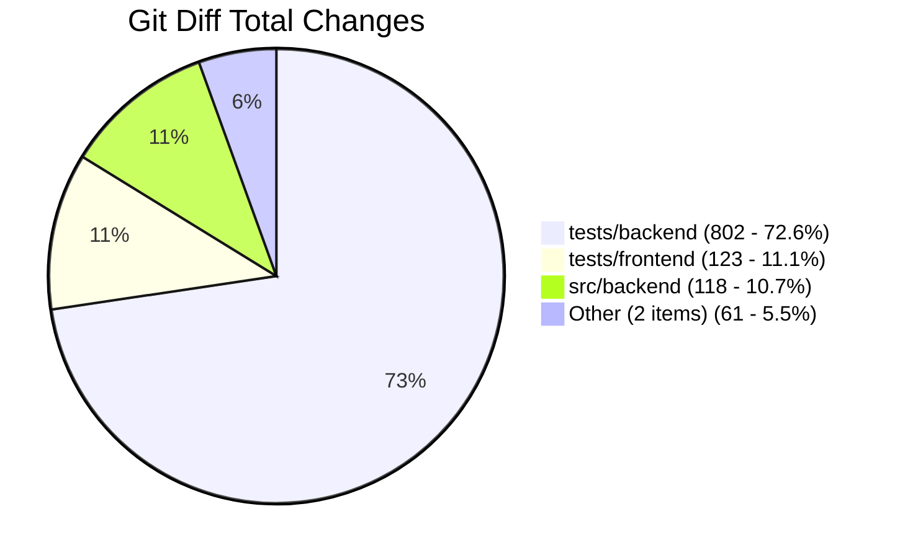
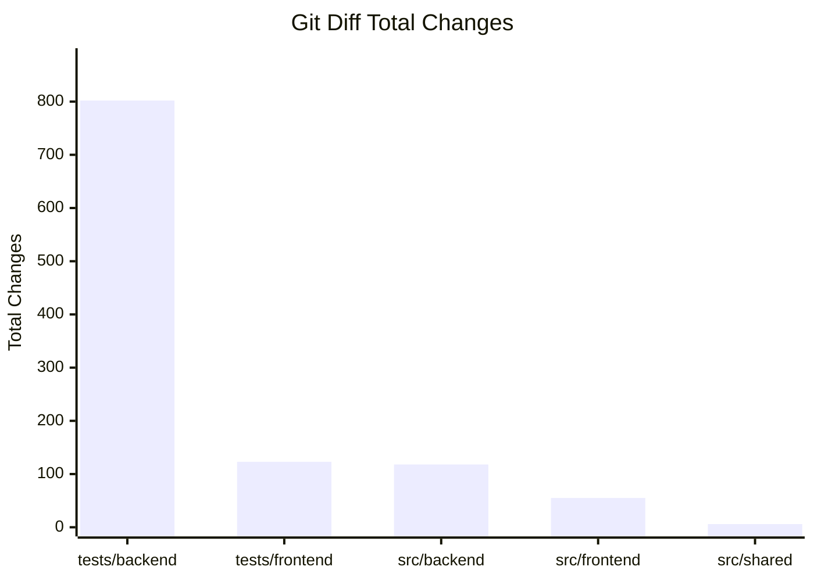

# git-diff-chart

[](https://github.com/zinefer/git-diff-chart/actions/workflows/main.yml)
[](https://www.npmjs.com/package/git-diff-chart)
[](https://www.npmjs.com/package/git-diff-chart)

**Visualize what changed in your pull requests.**

When your PR shows "2,247 lines changed," reviewers don't know where to start. This tool creates visual breakdowns that show what those changes actually represent, helping reviewers understand scope and prioritize their time.

## The Problem

Large pull requests are intimidating. When reviewers see thousands of lines changed across dozens of files, they often don't know where to focus their attention. The result? Rushed reviews, delayed merges, or PRs that sit unreviewed.

## The Solution

Instead of just showing line counts, show the breakdown:

```bash
git diff --numstat | npx git-diff-chart pie --title "User Profile Redesign" | xclip
```

This might reveal that your "2,000 line" PR is actually:
- 15% new feature code
- 60% comprehensive test coverage  
- 20% documentation updates
- 5% configuration changes

Now reviewers understand what they're looking at and can review strategically.

## Quick Start

```bash
# Create a pie chart of your changes.
npx git-diff-chart pie

# Get a detailed breakdown by directory
npx git-diff-chart bar --level 2
```

*If the git output is not piped in, the command will be run for you in current directory*

## Chart Types

### Pie Charts



### Bar Charts



## Options

### Common Options
- `-b, --base <branch>` - Compare against this branch (default: `main`)
- `-l, --level <number>` - Directory depth for grouping (default: `1`)
- `-f, --filter <pattern>` - Include only files matching regex
- `-i, --ignore <pattern>` - Exclude files matching pattern
- `-m, --metric <type>` - Count `total`, `additions`, or `deletions` (default: `total`)
- `-t, --title <title>` - Add a custom chart title

### Pie Charts
```bash
npx git-diff-chart pie [options]
```
- `--other-threshold <percent>` - Combine small slices below this percentage (default: `5`)

### Bar Charts  
```bash
npx git-diff-chart bar [options]
```
- `--max-items <number>` - Maximum number of items to show (default: `20`)

## Using in Pull Requests

Add the chart output to your PR description to give reviewers immediate context:

```markdown
## Changes Overview

[Paste chart here]

This PR adds user authentication. While the diff shows 800+ lines changed, 
most of that is test coverage and configuration updates.
```

## Advanced Usage

**Compare against different branches:**
```bash
npx git-diff-chart pie --base develop
```

**Focus on specific types of changes:**
```bash
# What's being added
npx git-diff-chart pie --metric additions

# What's being removed  
npx git-diff-chart bar --metric deletions
```

**Filter to specific areas:**
```bash
# Only show JavaScript files
npx git-diff-chart pie --filter "\.js$"

# Ignore test files
npx git-diff-chart bar --ignore "test|spec"
```

## Installation

**No installation needed**:
```bash
npx git-diff-chart pie
```

**For frequent use:**
```bash
npm install -g git-diff-chart
```

Requires Node.js 18+ and a git repository.

## 🤝 Contributing

We love contributions! Whether it's bug reports, feature requests, or pull requests - all are welcome.

- 🐛 **Found a bug?** [Open an issue](https://github.com/zinefer/git-diff-chart/issues)
- 💡 **Have an idea?** [Start a discussion](https://github.com/zinefer/git-diff-chart/discussions)
- 🔧 **Want to contribute?** Check out our [contributing guide](CONTRIBUTING.md)

---

**Made for developers who want to make large PRs approachable**

[⭐ Star on GitHub](https://github.com/zinefer/git-diff-chart) | [📦 View on npm](https://www.npmjs.com/package/git-diff-chart)